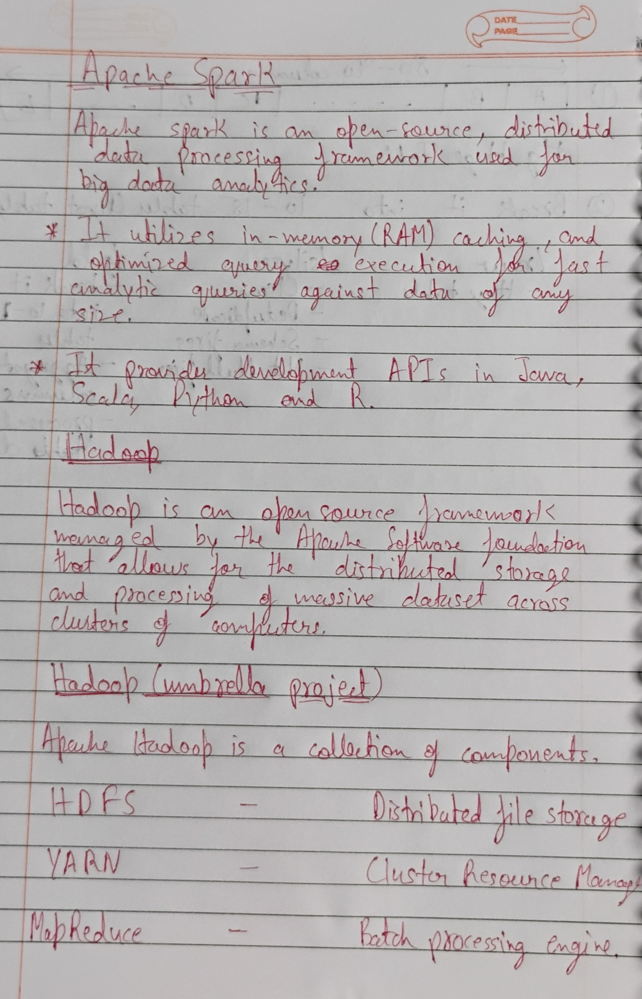
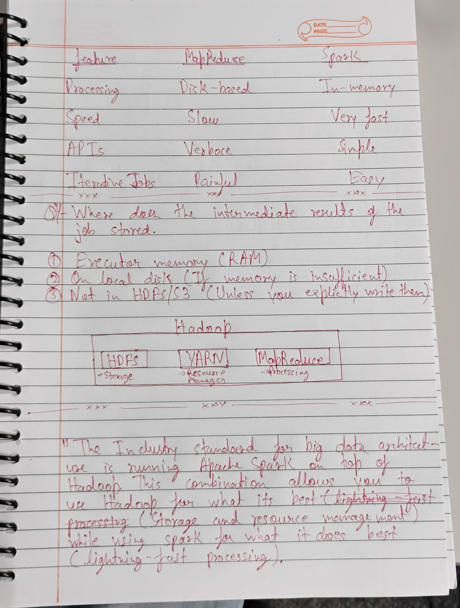

## Apache Spark







### Why Spark exists (Problems with MapReduce)
   " Spark exists to overcome MapReduce's slowness, primarily because MapReduce constantly writes intermediate data to disk, creating heavy I/O 
    overhead, while Spark processes data in-memory, making it significantly faster (up to 100x) for iterative tasks like machine learning and 
    real-time analytics, while also offering simpler APIs and unified processing for batch, streaming, and graph data."

### Problems with MapReduce (Why Spark was needed)
- Disk I/O Bottleneck: MapReduce writes intermediate data to disk after every map and reduce step, causing significant delays.
    
- Slow for Iterative Tasks: Its disk-based approach makes it inefficient for algorithms that repeatedly process the same data, like machine 
    learning or graph processing.
    
- Batch-Focused: Primarily designed for large-scale batch processing, lacking native support for real-time or interactive analysis.
    
- Complex for Many Use Cases: Required more boilerplate code compared to Spark's richer APIs (SQL, Streaming, MLlib). 

### How Spark Solves These Problems
- In-Memory Processing: Spark keeps data in RAM (memory) across multiple operations, drastically reducing disk I/O.
    
- Directed Acyclic Graph (DAG) Execution: It creates a DAG, optimizing the flow of operations and performing efficient multi-stage computations.
    
- Unified Engine: Offers built-in libraries (Spark SQL, Spark Streaming, MLlib, GraphX) for diverse tasks (SQL, streaming, ML, graph analytics) within one framework.
    
- Faster Performance: Achieves much faster speeds, especially for iterative and interactive workloads, making near real-time insights possible. 

### Q. where does the intermediate results being stored in spark?

In Spark, **intermediate results do not have a single storage location**. Where they live depends on *what kind* of intermediate data you are dealing with and *how Spark is configured*.

---

## 1. Default case: In Memory (RAM)

By design, Spark stores intermediate results **in executor memory**.

These include:
- Cached / persisted RDDs and DataFrames
- Intermediate stage outputs reused by downstream stages
- Shuffle buffers (before spilling)

Key points:
- Stored in **executor JVM heap and off-heap memory**
- Managed by Spark’s **unified memory manager**
- Automatically evicted when memory pressure increases

If it fits in memory → **no disk I/O**.

---

## 2. When memory is insufficient: Spill to Local Disk

Spark spills data to disk when memory is not enough.

Spill happens for:
- Shuffles
- Sorts
- Aggregations
- Joins

Where it spills:
- **Local disk on executor nodes**
- Configured via `spark.local.dir` (default often `/tmp`)

Important:
- This is **not HDFS or S3**
- Data is **temporary**
- Deleted after the job or executor exits

---

## 3. Shuffle Data (Special Case)

Shuffle data is **always written to local disk** at some point.

Why:
- Shuffles can be very large
- Executors need to fetch data from other executors
- Data must survive task retries

Process:
- Map task output → local disk
- Reduce task fetches data over the network

This is unavoidable in distributed systems.

---

## 4. Persisted / Cached Data (Explicit Storage Levels)

If you explicitly persist data:

```python
df.persist(StorageLevel.MEMORY_ONLY)
```

#### Q. First: What is “Distributed Computing”?
"Doing one computation by splitting the work across multiple machines (or CPUs) at the same time, instead of using only one machine."

So instead of:
- 1 computer
- 1 CPU / limited memory
- Processing everything sequentially

We use:
- Many machines (nodes)
- Many CPUs + combined memory
- Processing in parallel

**Think of it as teamwork for computers.**

## Why Normal (Single-Machine) Computing Breaks Down

Let’s start with a real problem.
Example:
- You have:
    500 GB of log data
    A normal laptop has:
    8–16 GB RAM
    1 CPU (or a few cores)

- What happens?

    ❌ Problem 1: Memory Limit
        You cannot load 500 GB into RAM
        Disk-based processing becomes extremely slow

    ❌ Problem 2: Time
        Even if you process line by line:
        One CPU
        Sequential execution
        It may take hours or days

    ❌ Problem 3: CPU Bottleneck
        Only one machine is doing all the work
        Other CPUs in the world are idle

👉 Conclusion: Single-machine computing does not scale.

## Distributed Computing Solves This

- Now imagine: 10 machines
- Each machine has:
    16 GB RAM
    4 CPU cores
- Combined Power:
    160 GB RAM
    40 CPU cores
Instead of:
    One machine processes 500 GB
We do:
    Each machine processes 50 GB
    
🔥 Same logic, but 10× faster and possible to run

This is distributed computing.